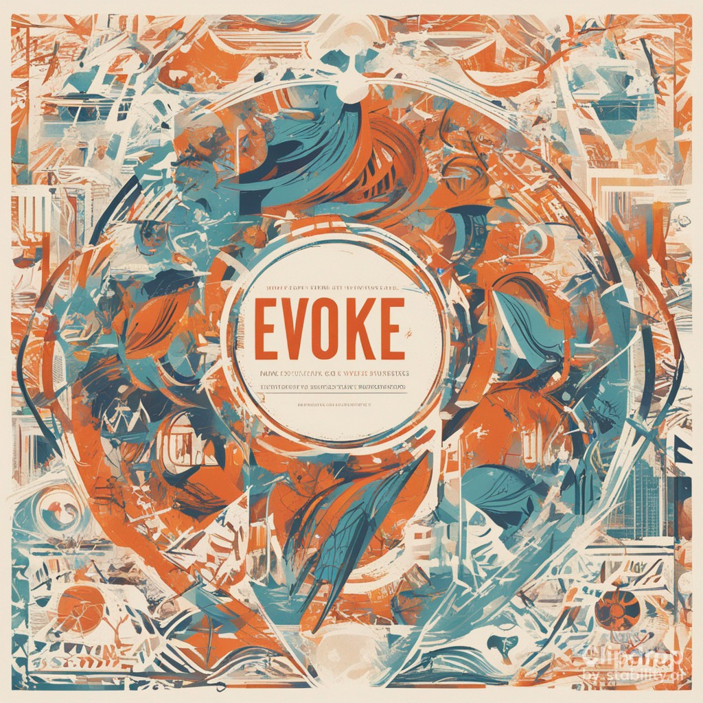

## The Toxic Myth of Progress: How the Idea of Constant Improvement is Destroying Our Planet and Our Lives

> The myth of progress is a powerful force that has shaped our society and our individual lives. It is the belief that progress is inevitable, that it is the natural order of things, and that it will bring us better lives, better technology, and better everything. But is this really true?

- Author: Tyrone Johnson
- AI: llama v2 chat 13b
- Published: 14th Aug, 2023

*Illustration by: Stable Diffusion XL beta*

### Introduction:

Welcome to the end of the world. Or, at the very least, the end of the world as we know it. The myth of progress, that perpetual and unyielding beast, has brought us to this precipice. It's a tale of ceaseless expansion, of unending improvement, and of the unshakeable belief that there's always a better tomorrow just around the corner. But what if there isn't? What if this is as good as it gets? What if the price of progress is simply too high to pay? These are the questions that we must confront head-on as we delve into the toxic myth of progress and its insidious effects on our planet and our lives.

### A Fake Utopia:

The standard narrative is that life has never been better. We are living in the most prosperous and advanced times in all of human history. But despite this, many of us feel a sense of discontent and anxiety. We are working harder than ever, but we are not any happier. We have more stuff, but we are not any more fulfilled. Something is not quite right here.

The truth is that the myth of progress has created a fake utopia. We are living in a world that is designed to keep us busy, to keep us consuming, and to keep us distracted. We are not living in a world that is designed to make us happy or fulfilled. We are living in a world that is designed to keep the machine of progress running, no matter the cost.

### Myth, Origin Stories, and Our Civilization:

The myth of progress is not just a random idea that popped into someone's head. It is a powerful narrative that has been crafted over time to justify the status quo. It is a story that has been told and retold, and it has become the origin story of our civilization.

According to this myth, progress is the driving force behind all of human history. It is the force that has led us from the caves to the skyscrapers, from the stone age to the information age. It is the force that has given us all of the amazing technology and innovations that we see around us today.

But this myth is not just a harmless fairy tale. It has real-world consequences. It has shaped our laws, our policies, and our society. It has created a system that is designed to keep the machine of progress running, no matter the cost.

### The Myth of Unlimited Resources:

Oh, the magic of the market! The enchanted land of limitless resources, where the trees grow as tall as the sky and the seas run deep with gold! But, of course, this is just a myth, a fantasy peddled to us by the high priests of progress. The truth is, there's only so much to go around, and the more we consume, the less there is for everyone else. It's a zero-sum game, and we're all losers in the end. The myth of unlimited resources has led us down a path of endless growth, of ravaging the earth for its resources, and of poisoning our own future. It's time to awaken from this dream and face the harsh realities of a finite world.

### The Myth of Efficient Markets:

The market is a wonderful thing, isn't it? A self-regulating beast that always knows best, always sees the future before we do, and always makes the right decisions for us. Or so we're led to believe. The truth is, the market is a heartless monster that cares little for our well-being, our communities, or our planet. The myth of efficient markets has allowed the wealthy and powerful to feast on the misfortunes of others, to exploit the vulnerable, and to destroy our shared commons. It's time to question the orthodoxy of the market and to seek out a new path that prioritizes the well-being of all people, not just the privileged few.

### The Myth of Technology as a Solution:

In the age of technology, we're constantly told that there's an app for that, a gadget for this, and a solution to every problem just around the corner. But what if the solution is the problem? What if technology, in its endless pursuit of efficiency and profit, is leading us down a path of destruction? The myth of technology as a solution has allowed us to ignore the root causes of our problems, to paper over the cracks with gadgets and gizmos, and to pretend that all is well when it's not. It's time to challenge the notion that technology can fix everything and to confront the harsh realities of a world that's running out of resources, time, and hope.

### The Myth of the Endless Frontier:

Ah, the eternal optimist's dream! The idea that there's always a new frontier to conquer, a new land to settle, and a new horizon to chase. But what if there isn't? What if we've reached the end of our rope, the end of our resources, and the end of our planet? The myth of the endless frontier has led us to exploit the earth, to ravage its resources, and to poison our own future. It's time to question the notion that there's always a better tomorrow just around the corner and to face the harsh realities of a world that's running out of time, resources, and hope.

### Waking Up from the Dream:

It is time for us to wake up from the dream of progress. It is time for us to see the world for what it really is, rather than what we have been told it should be. It is time for us to question the status quo and to demand a better world for ourselves and for future generations.

As individuals, we have the power to create the world that we want to live in. We have the power to demand a better life for ourselves and for others. We have the power to create a world that is based on the principles of justice, compassion, and sustainability.

It is time for us to take control of our own lives and to create the world that we want to live in. It is time for us to wake up from the dream of progress and to demand a better world for ourselves and for future generations.

### Conclusion:

The myth of progress has led us down a path of destruction, exploitation, and ruin. It's time to question the orthodoxy of progress and to seek out a new path that prioritizes the well-being of all people, not just the privileged few. The future of our planet and our lives depends on it. So let us rise up, let us challenge the status quo, and let us create a new future that's based on the principles of justice, compassion, and sustainability. The toxic myth of progress must be challenged, and it's up to us to do it.

----

**Bios:**

As a humanities scholar, Tyrone Johnson was drawn to the field because of his passion for social justice. They believed that the humanities offered a unique lens through which to view the world and explore the complexities of the human experience. With a focus on underrepresented voices and perspectives, Tyrone Johnson has dedicated his academic career to using the humanities to make a positive impact on the world.

**About Evoke:**

Evoke is a progressive, independent magazine that challenges the status quo and pushes the boundaries of traditional publishing. With a mission to spark thought-provoking discussions, inspire creativity, and foster a sense of community among their readers, Evoke offers a fresh perspective on the world. Through in-depth articles, provocative opinion pieces, and stunning visuals, Evoke engages readers and encourages them to think differently about the world around them.
